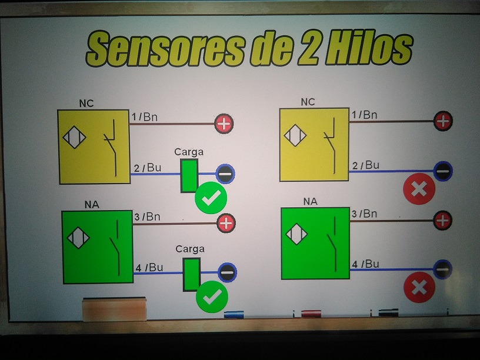
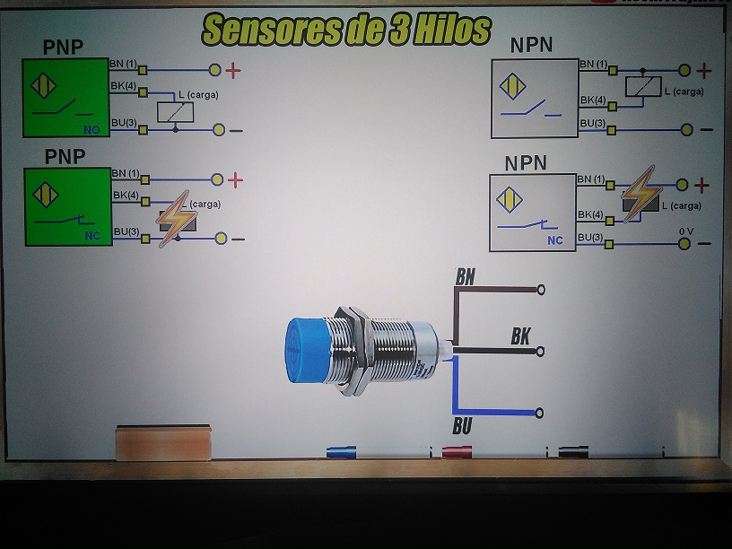

---

- Aqui tienes un enlace para visitar mi Portafolio.

[PORTAFOLIO](https://juamaya.github.io/portafolio)

---

![alt text][logo]


---


---

## SINTAXIS MARKDOWN

Here's markdown logo (hover to see the title text):

![alt text][logo]

[logo]: https://github.com/adam-p/markdown-here/raw/master/src/common/images/icon48.png "Este es el logo de Markdown"

---

## ENCABEZADOS

```


# Encabezado 1
## Encabezado 2
### Encabezado 3
#### Encabezado 4
##### Encabezado 5
###### Encabezado 6

```

# Encabezado 1

## Encabezado 2

### Encabezado 3

#### Encabezado 4

##### Encabezado 5

###### Encabezado 6

---

## TABLAS

```


|MARKDOWN	 |RESULTADO    |
|:--------- :|:---------:  |
|\*cursiva*  |	*cursiva*  |
|\_cursiva_  |	_cursiva_  |
|\**negrita**|	**negrita**|
|\__negrita__|	__negrita__|
|\~tachado~  |  ~~TACHADO~~|

```

|    MARKDOWN     |  RESULTADO  |
| :-------------: | :---------: |
|   \*cursiva\*   |  _cursiva_  |
|   \_cursiva\_   |  _cursiva_  |
| \*\*negrita\*\* | **negrita** |
| \_\_negrita\_\_ | **negrita** |
|   \~tachado~    | ~~TACHADO~~ |

---

## BLOQUES DE CODIGOS

\~~~
Creando códigos de bloque.
Puedes añadir tantas líneas como quieras. ~~~

\```
Creando códigos de bloque.
Puedes añadir tantas líneas como quieras.```

```

Creando códigos de bloque.
Puedes añadir tantas líneas  como quieras.
```

---

## Listas desordenadas

Para crear listas desordenadas utiliza \* asteriscos, - guiones, o + símbolo de suma.

- Elemento de lista 1
- Elemento de lista 2

* Elemento de lista 3
* Elemento de lista 4

- Elemento de lista 5
- Elemento de lista 6

---

## Listas ordenadas

Para crear listas ordenadas debes utilizar la sintaxis de tipo: «número.» 1.

1. Elemento de lista 1
2. Elemento de lista 2
   - Elemento de lista 3
   - Elemento de lista 4
     1. Elemento de lista 5
     2. Elemento de lista 6

---

## ENLACES

```

 [enlace en línea](http://www.google.com)
```

[enlace en línea](http://www.google.com)

---

## IMAGENES

```


```


---

## VIDEOS

```html
<div className="embed-responsive embed-responsive-16by9">
  <iframe width="560" height="315" src="https://www.youtube.com/embed/kKHGgRUfNfc" title="YouTube video player" frameBorder="0" allow="accelerometer; autoplay; clipboard-write; encrypted-media; gyroscope; picture-in-picture; web-share" allowFullScreen></iframe>
</div>
```

<div className="embed-responsive embed-responsive-16by9">
   <iframe width="560" height="315" src="https://www.youtube.com/embed/CG3N1uKgK6Q" title="YouTube video player" frameBorder="0" allow="accelerometer; autoplay; clipboard-write; encrypted-media; gyroscope; picture-in-picture; web-share" allowFullScreen></iframe>
  
</div>

---

## Aqui te muestro como conectar **Sensores**.





---

## Usando React.js

:::tip

Use the power of React to create interactive blog posts.

```js
<button onClick={() => alert("button clicked!")}>Click me!</button>
```

<button onClick={() => alert('button clicked! Welcome.')}>Click me!</button>

:::

---

## Usando index.html

> \*Aqui tienes el codigo basico para crear una pagina web con **_html._**

```html
<!DOCTYPE html>
<html lang="en">
  <head>
    <meta charset="utf-8" />
    <meta name="viewport" content="width=device-width, initial-scale=1" />
    <title>My Web</title>
  </head>
  <body>
    <h1>Hello, world!</h1>
  </body>
</html>
```

> \*Aqui otro codigo basico para crear una pagina web con **_html y bootstrap._**

> Include the CDN: Bootstrap’s CSS and JS.

```html
<!DOCTYPE html>
<html lang="en">
  <head>
    <meta charset="utf-8" />
    <meta name="viewport" content="width=device-width, initial-scale=1" />
    <title>Bootstrap demo</title>
    <link
      href="https://cdn.jsdelivr.net/npm/bootstrap@5.2.3/dist/css/bootstrap.min.css"
      rel="stylesheet"
      integrity="sha384-rbsA2VBKQhggwzxH7pPCaAqO46MgnOM80zW1RWuH61DGLwZJEdK2Kadq2F9CUG65"
      crossorigin="anonymous"
    />
  </head>
  <body>
    <h1>Hello, world!</h1>

    <script
      src="https://cdn.jsdelivr.net/npm/bootstrap@5.2.3/dist/js/bootstrap.bundle.min.js"
      integrity="sha384-kenU1KFdBIe4zVF0s0G1M5b4hcpxyD9F7jL+jjXkk+Q2h455rYXK/7HAuoJl+0I4"
      crossorigin="anonymous"
    ></script>
  </body>
</html>
```

---

> Aqui pongo texto de relleno

_Lorem ipsum dolor sit amet, consectetur adipiscing elit. Pellentesque elementum dignissim ultricies. Fusce rhoncus ipsum tempor eros aliquam consequat. Lorem ipsum dolor sit amet_
**distinctio facere dolorum unde nam magnam earum ea qui, deserunt reiciendis quod nihil. Ad explicabo, rem maiores nisi et cupiditate eligendi, fugiat asperiores dolores ipsa ex quo, iste illo aliquid inventore praesentium? Iure quaerat beatae inventore magni veniam vero eveniet necessitatibus placeat nostrum** `delectus distinctio sit doloremque accusamus sapiente. Laboriosam obcaecati modi placeat ipsa `
