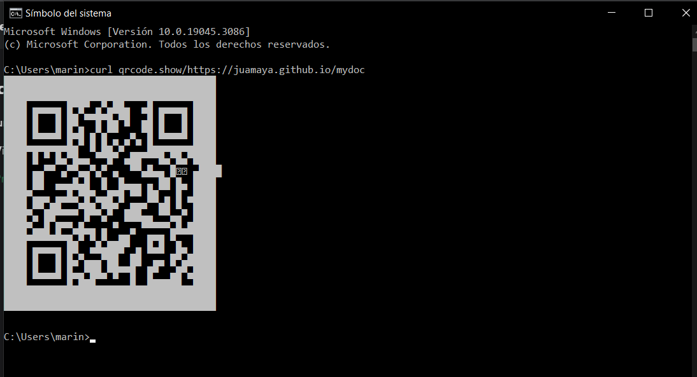

---

- Aqui tienes un enlace para visitar mi Portafolio.

[PORTAFOLIO](https://juamaya.github.io/portafolio)

---


- Aqui tienes un enlace para visitar una pagina web. 

[WEB](https://juamaya.github.io/web)

---


- Aqui tienes un enlace para visitar una pagina web que consume una API. 

[RICK and MORTY](https://juamaya.github.io/morty)

---

- Aqui tienes un enlace para visitar una pagina web que utiliza una libreria particles-js. 

[Particulas](https://juamaya.github.io/particulas)

---

![alt text][logo]


---
> Imagen creada con Inteligencia Artificial


---


## Crear codigos QR con la consola de comandos o CMD.


> El Símbolo del sistema, también llamado CMD, forma parte de Windows y no puede ser desinstalado. Es una herramienta que, mediante comandos, permite realizar acciones avanzadas.

> Escribir el comando y una URL o tu nombre todo **junto** y pulsar enter.

`curl qrcode.show/Antonio-Lopez ` 

> Ejemplo:
    
 
---
 


## SINTAXIS MARKDOWN

Here's markdown logo (hover to see the title text):

![alt text][logo]

[logo]: https://github.com/adam-p/markdown-here/raw/master/src/common/images/icon48.png "Este es el logo de Markdown"

---

## ENCABEZADOS

```


# Encabezado 1
## Encabezado 2
### Encabezado 3
#### Encabezado 4
##### Encabezado 5
###### Encabezado 6

```

# Encabezado 1

## Encabezado 2

### Encabezado 3

#### Encabezado 4

##### Encabezado 5

###### Encabezado 6

---

## TABLAS

```


|MARKDOWN	 |RESULTADO    |
|:--------- :|:---------:  |
|\*cursiva*  |	*cursiva*  |
|\_cursiva_  |	_cursiva_  |
|\**negrita**|	**negrita**|
|\__negrita__|	__negrita__|
|\~tachado~  |  ~~TACHADO~~|

```

|    MARKDOWN     |  RESULTADO  |
| :-------------: | :---------: |
|   \*cursiva\*   |  _cursiva_  |
|   \_cursiva\_   |  _cursiva_  |
| \*\*negrita\*\* | **negrita** |
| \_\_negrita\_\_ | **negrita** |
|   \~tachado~    | ~~TACHADO~~ |

---

## BLOQUES DE CODIGOS

\~~~
Creando códigos de bloque.
Puedes añadir tantas líneas como quieras. ~~~

\```
Creando códigos de bloque.
Puedes añadir tantas líneas como quieras.```

```

Creando códigos de bloque.
Puedes añadir tantas líneas  como quieras.
```

---

## Listas desordenadas

Para crear listas desordenadas utiliza \* asteriscos, - guiones, o + símbolo de suma.

- Elemento de lista 1
- Elemento de lista 2

* Elemento de lista 3
* Elemento de lista 4

- Elemento de lista 5
- Elemento de lista 6

---

## Listas ordenadas

Para crear listas ordenadas debes utilizar la sintaxis de tipo: «número.» 1.

1. Elemento de lista 1
2. Elemento de lista 2
   - Elemento de lista 3
   - Elemento de lista 4
     1. Elemento de lista 5
     2. Elemento de lista 6

---

## ENLACES

```

 [enlace en línea](http://www.google.com)
```

[enlace en línea](https://www.google.com)

<https://www.google.com>

---

## IMAGENES

```


```


---

## VIDEOS

```html
<div className="embed-responsive embed-responsive-16by9">
  <iframe width="560" height="315" src="https://www.youtube.com/embed/kKHGgRUfNfc" title="YouTube video player" frameBorder="0" allow="accelerometer; autoplay; clipboard-write; encrypted-media; gyroscope; picture-in-picture; web-share" allowFullScreen></iframe>
</div>
```

 


---

## Usando React.js

:::tip

Use the power of React to create interactive blog posts.

```js
<button onClick={() => alert("button clicked!")}>Click me!</button>
```

<button onClick={() => alert('button clicked! Welcome.')}>Click me!</button>

:::

---
 
    
 
 

 

---
> Aqui pongo texto de relleno

_Lorem ipsum dolor sit amet, consectetur adipiscing elit. Pellentesque elementum dignissim ultricies. Fusce rhoncus ipsum tempor eros aliquam consequat. Lorem ipsum dolor sit amet_
**distinctio facere dolorum unde nam magnam earum ea qui, deserunt reiciendis quod nihil. Ad explicabo, rem maiores nisi et cupiditate eligendi, fugiat asperiores dolores ipsa ex quo, iste illo aliquid inventore praesentium? Iure quaerat beatae inventore magni veniam vero eveniet necessitatibus placeat nostrum** `delectus distinctio sit doloremque accusamus sapiente. Laboriosam obcaecati modi placeat ipsa `
