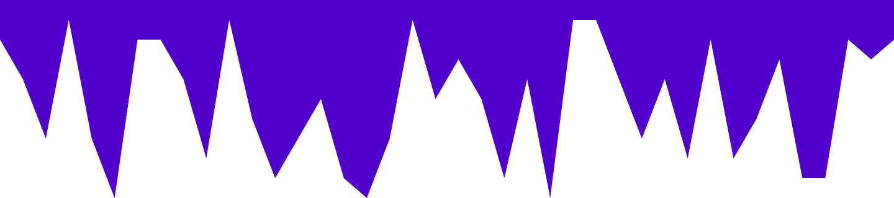
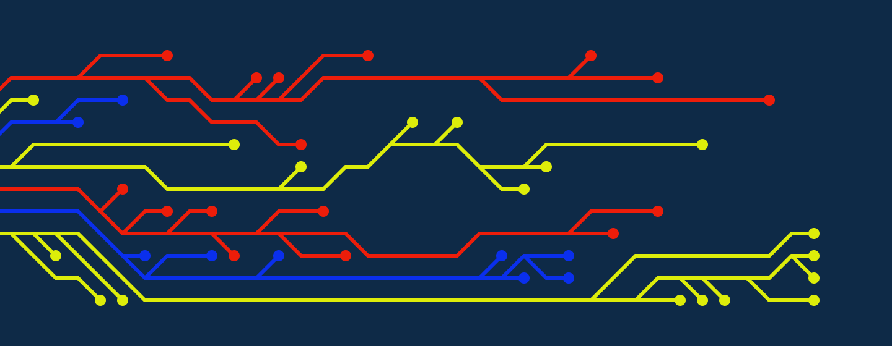
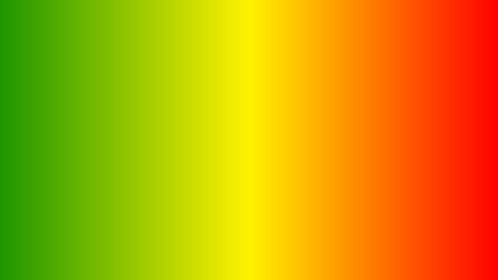
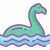
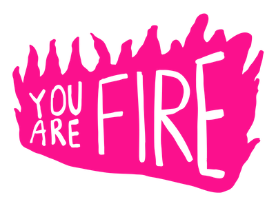
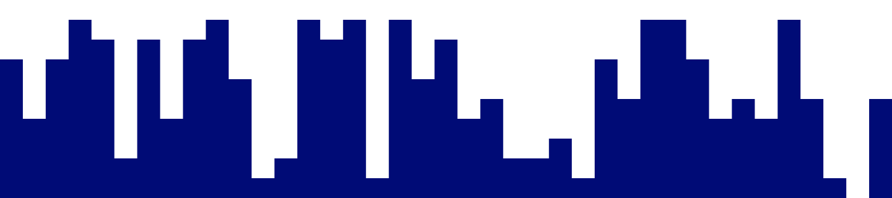
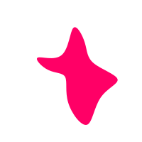
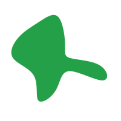

---
###  * En este enlace contiene varios recursos. 

 [recursos.cuarzo](https://recursos.cuarzo.dev/)

---
### \* Edit, Convert, Create

[123apps](https://123apps.com/)

---

### \* Imágenes.

[unsplash](https://unsplash.com/)

[pexels](https://www.pexels.com/)

[freepik](https://www.freepik.es/)

---

### \* Quitar fondo de Imágenes.

[remove.bg](https://www.remove.bg/)

[cleanup.pictures](https://cleanup.pictures/)

---

### \* Compresión de imagenes .

[tinypng](https://tinypng.com/)

---

### \* Imágenes tools.

[onlineimagetools](https://onlineimagetools.com/)

---

### \* background.

[bgjar](https://bgjar.com/)

---

### \* Colores.

[colorhunt](https://colorhunt.co/)

---

### \* Gradientes

[uigradients](https://uigradients.com//)

---

### \* Iconos.

[boxicons](https://boxicons.com/)

[iconfinder](https://www.iconfinder.com/)

[icons8](https://icons8.com/)

[flagicons](https://flagicons.lipis.dev/)

---

### \* Logos.

[logoipsum](https://logoipsum.com/)

---

### \* Ilustraciones.

[undraw](https://undraw.co/illustrations)

[humaaans](https://humaaans.com/)

---

## \* Paginas Web de recursos HTML y CSS.

---

[allthetags](https://allthetags.com/)

[css3generator](https://css3generator.com/)

[cssmatic](https://cssmatic.com/)

[omatsuri](https://omatsuri.app/)

[getwaves](https://getwaves.io/)

[blobmaker](https://www.blobmaker.app/)

[uiverse](https://uiverse.io/)

---
