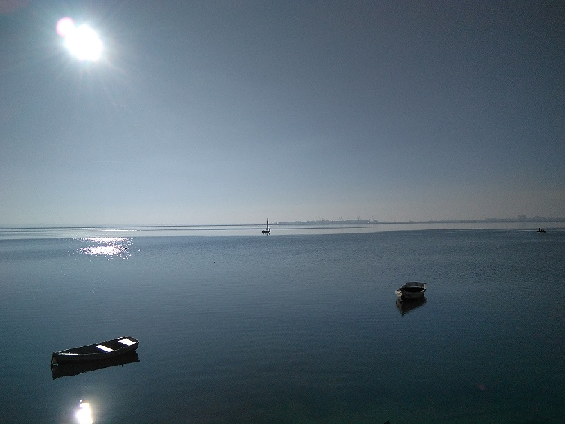

---

 

> ### Aqui tienes unos enlaces para ver algunas Paginas Web.

[PORTAFOLIO](https://juamaya.github.io/portafolio)

[portafolio-juan](https://juamaya.github.io/portafolio-juan/)
 
[WEB](https://juamaya.github.io/web)
 
[WEB-SLIDER](https://juamaya.github.io/web-slider)
 
[WEB-ROUTER](https://juamaya.github.io/web-router)
 
[WEB-GRID](https://juamaya.github.io/web-grid)
 
[MENU-SLIDER](https://juamaya.github.io/menu-slider)
 

> ### Aqui tienes enlaces para visitar unas paginas web que consume una API. 

[RICK and MORTY](https://juamaya.github.io/morty)
 
[POKEMON](https://juamaya.github.io/pokemon)

> ### Aqui tienes un enlace para visitar una pagina web que utiliza una libreria particles-js. 

[PARTICULAS ](https://juamaya.github.io/particles)
 

---

>### Playa Urbana La cachucha, Puerto Real

---
 