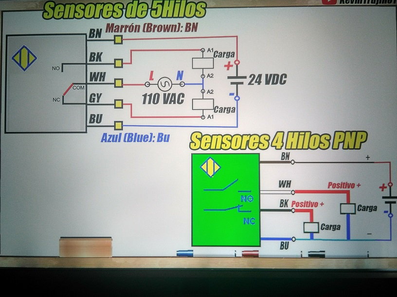

---


---
 * Aqui tienes un enlace para visitar mi Portafolio.

[PORTAFOLIO](https://juamaya.github.io/portafolio)

---
![alt text][logo]


---

>Usando React.js

:::tip

Use the power of React to create interactive blog posts.

```js
<button onClick={() => alert('button clicked!')}>Click me!</button>
```

<button onClick={() => alert('button clicked! Welcome.')}>Click me!</button>

:::

> *Aqui tienes el codigo basico para crear una pagina web con ***html.***


```html
<!doctype html>
<html lang="en">
  <head>
    <meta charset="utf-8">
    <meta name="viewport" content="width=device-width, initial-scale=1">
    <title>My Web</title>
  </head>
  <body>
    <h1>Hello, world!</h1>
  </body>
</html>
```
> *Aqui otro codigo basico para crear una pagina web con ***html y bootstrap.***

> Include the CDN:  Bootstrap’s CSS and JS.

```html
<!doctype html>
<html lang="en">
  <head>
    <meta charset="utf-8">
    <meta name="viewport" content="width=device-width, initial-scale=1">
    <title>Bootstrap demo</title>
    <link href="https://cdn.jsdelivr.net/npm/bootstrap@5.2.3/dist/css/bootstrap.min.css" rel="stylesheet" integrity="sha384-rbsA2VBKQhggwzxH7pPCaAqO46MgnOM80zW1RWuH61DGLwZJEdK2Kadq2F9CUG65" crossorigin="anonymous">
  </head>
  <body>
    <h1>Hello, world!</h1>


    <script src="https://cdn.jsdelivr.net/npm/bootstrap@5.2.3/dist/js/bootstrap.bundle.min.js" integrity="sha384-kenU1KFdBIe4zVF0s0G1M5b4hcpxyD9F7jL+jjXkk+Q2h455rYXK/7HAuoJl+0I4" crossorigin="anonymous"></script>
  </body>
</html>
```
 
 

Here's markdown  logo (hover to see the title text):

 
![alt text][logo]

[logo]: https://github.com/adam-p/markdown-here/raw/master/src/common/images/icon48.png "Este es el logo de Markdown"
 
---
###  Aqui te muestro como conectar **Sensores**.




---


---
Atributos de texto _cursiva_ , **negrita** , `monoespaciado` .
> Aqui pongo texto de relleno

_Lorem ipsum dolor sit amet, consectetur adipiscing elit. Pellentesque elementum dignissim ultricies. Fusce rhoncus ipsum tempor eros aliquam consequat. Lorem ipsum dolor sit amet_
Lorem, ipsum dolor sit amet consectetur adipisicing elit. Ducimus molestias perferendis temporibus adipisci ipsam assumenda? Tenetur repellendus perspiciatis sit itaque. Sapiente dignissimos consectetur reprehenderit quaerat expedita deleniti, amet eligendi aliquam quam **distinctio facere dolorum unde nam magnam earum ea qui, deserunt reiciendis quod nihil.  Ad explicabo, rem maiores nisi et cupiditate eligendi,   fugiat asperiores dolores ipsa ex quo, iste illo aliquid inventore praesentium? Iure quaerat beatae inventore magni veniam vero  eveniet necessitatibus placeat nostrum**, exercitationem repellendus non nesciunt officia autem aspernatur perferendis, quam dicta perspiciatis dignissimos `delectus distinctio sit doloremque accusamus sapiente. Laboriosam obcaecati modi placeat ipsa `inventore fugit distinctio.

 