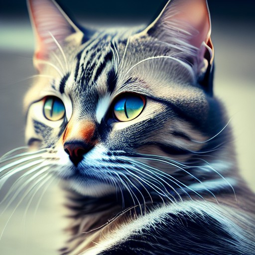

---
## * Anima y darle color a tus fotos.

[myheritage](https://www.myheritage.es)

---
* Aqui animo una foto.

[padre](papa.mp4)

* Aqui animo y le pongo color a  una foto.

[padres](PADRES1-2-Animated.mp4)

* Aqui  le pongo color a  una foto.
 

 
 ---

 
##* Generador de Imágenes.

[freeimage.ai](https://freeimage.ai/)

[picfinder.ai](https://picfinder.ai/)

[lexica.art](https://lexica.art/)

---

> Imagen  creada con Inteligencia Artificial

---

## * Crear memes. 

[app.supermeme.ai](https://app.supermeme.ai/)

---

> Memes  creado con Inteligencia Artificial

Cuando tú y tu compañero de trabajo celebran haber obtenido un aumento de sueldo, pero aún no puedes pagar una tostada de aguacate.

---

 