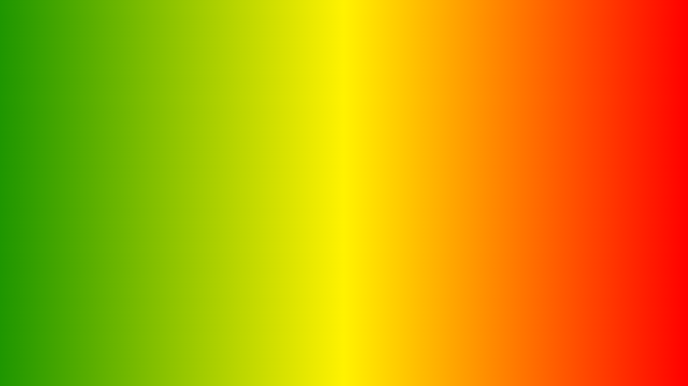
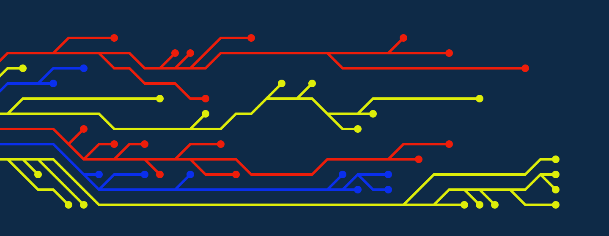

---
 
slug:  blog-post
title:  Recursos Web  Blog
authors:
  name: JUAN MARIN
  title:  Paginas Web de recursos para programadores.
 
 
tags: [hola, docusaurus, Markdown, Marin]
---

 
---

### * Edit, Convert, Create
[123apps](https://123apps.com/)

---

###  * Gradientes
[uigradients](https://uigradients.com//)

---

###  *  Imágenes.

[unsplash](https://unsplash.com/)

[pexels](https://www.pexels.com/)

---

###  *  Quitar fondo de Imágenes.

[remove.bg](https://www.remove.bg/)

---
###  * Generador de Imágenes.

[freeimage.ai](https://freeimage.ai/)
 
> Imagen creada con Inteligencia Artificial

---
###  *  Imágenes tools.

[onlineimagetools](https://onlineimagetools.com/)

---

###  *   background.

[bgjar](https://bgjar.com/)

---

###  * Colores.

[colorhunt](https://colorhunt.co/)

---

###  * Iconos.

[boxicons](https://boxicons.com/)

[iconfinder](https://www.iconfinder.com/)

[icons8](https://icons8.com/)

[flagicons](https://flagicons.lipis.dev/)

---

###  * Logos.

[logoipsum](https://logoipsum.com/)

 

---

###  * Ilustraciones.

[undraw](https://undraw.co/illustrations)

---

###  * Compresión de imagenes .

[tinypng](https://tinypng.com/)

---
##  * Paginas Web de recursos CSS.

---

 

### [getwaves](https://getwaves.io/)

###   [blobmaker](https://www.blobmaker.app/)

###   [uiverse](https://uiverse.io/)

---