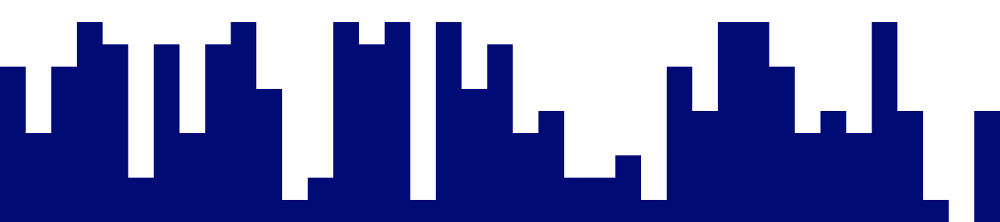

## Paginas Web de recursos para programadores.
---

### * Edit, Convert, Create
[123apps](https://123apps.com/)

---

###  * Gradientes
[uigradients](https://uigradients.com//)

---

###  *  Imágenes.

[imágenes](https://unsplash.com/)

---

###  *  Imágenes tools.

[onlineimagetools](https://onlineimagetools.com/)

---

###  *   background.

[background](https://bgjar.com/)

---

###  * Colores.

[Colores](https://colorhunt.co/)

---

###  * Iconos.

[Iconos](https://boxicons.com/)

---

###  * Logos.

[logo](https://logoipsum.com/)

---

###  * Ilustraciones.

[Ilustraciones](https://undraw.co/illustrations)

---

###  * Compresión de imagenes .

[Compresión](https://tinypng.com/)

---
## Paginas Web de recursos CSS.

---

 

### [getwaves](https://getwaves.io/)

###   [blobmaker](https://www.blobmaker.app/)

###   [uiverse](https://uiverse.io/)

---