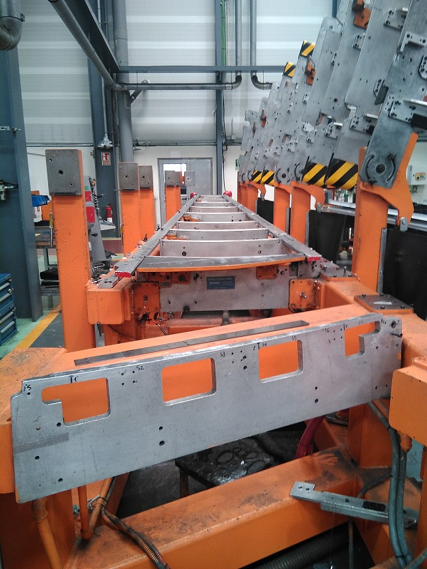

# Fase1-DG
---
> Grada

---

## Secuencia de operaciones.
---
>CARGAR REVESTIMIENTOS y CERRAR CUCHILLAS

## op10
>COMPROBAR y FIJAR PAÑOS

---

## op20
>TALADRAR TALADROS DE INTERCAMBIALIDAD

---

## op30
>TALADRAR KARMANS REVESTIMIENTO INFERIOR

---

## op40
>RECANTEAR ZONA COSTILLA 14

---

## op50
>TALADRAR A PREVIO COSTILLA 3 Y ANGULARES RS y FS

---

## op60
>TALADRAR A DEFINITIVO COSTILLA 2 Y ANGULAR  FS solo al 50%

---

## op70
>SITUAR y FIJAR COSTILLAS 4 a 13

---

## op80
>SITUAR y TALADRAR ANGULARES FS A COSTILLAS

---

## op90
>SITUAR y TALADRAR HERRAJES METALICOS EN C4 y C9

---
## op100
>GALGEAR ANGULARES y COSTILLAS

---
## op110
>TALADRAR KARMANS REVESTIMIENTO SUPERIOR 

> DESMONTAR REGLETAS, TENSORES y TOPES RS 

> ABRIR CUCHILLAS y DESMONTARLAS
  
---
## op120
>COMPROBACION FOD

---
## op130
>PREPARAR ELEMENTO PARA TRASLADAR AL FG

--- 
 