 
# Fase1-FG
 

## Secuencia de operaciones.

## op 10
+ Taladrar porteria en revestimiento superior.
+ Utilizar plantilla.
+ Secuencia de taladrado 2,5 - 4,15.
+ Rebarbar.

## op 20
+ Taladrar drenajes en revestimiento inferior.
+ Secuencia de taladrado 2,5 - 4,8 - 6,33.
+ Rebarbar.

## op 30
+ Taladrar costillas de 4 a 13 en revestimiento superior e inferior.
+ Secuencia de taladrado costillas 9 a 13: 2,5 - 3,25 - 4,17
+ Secuencia de taladrado costillas 4 a 8: 2,5 - 3,25 - 4,84
+ Rebarbar.

## op 40

+ Taladrar costillas de 2 y 3 en revestimiento superior e inferior.
+ Secuencia de taladrado: 2,5 - 3,25 - 4,84 - 6,33
+ Rebarbar.

## op 50
+ Rebarbar Taladros de Intercambialidad.
+ En Revestimiento superior e inferior.
+ Caras exterior e interior.

## op 60
+ Situar y taladrar a previo bandas portatuercas, karmans y soportes electicos.
1. Situar y taladrar a previo bandas portatuercas 

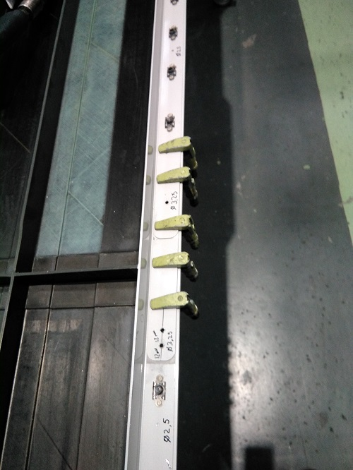

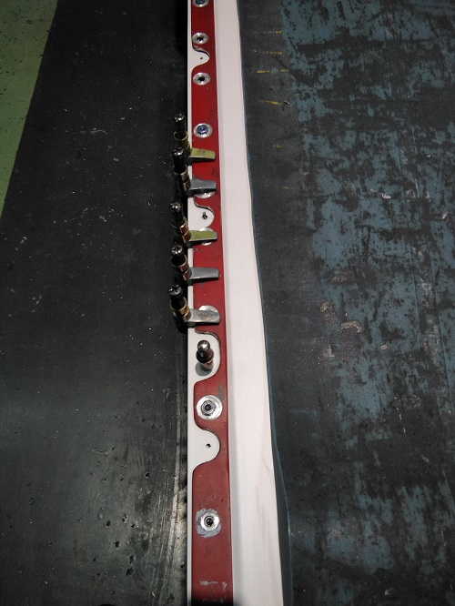

2. Situar y taladrar a previo karmans.

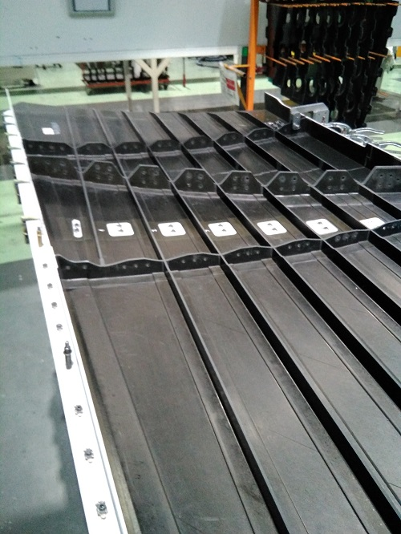

3. Situar y taladrar a previo  soportes electicos.

## op 70
+ Situar y taladrar bandas rigidas.
+ Utilizar plantilla. 

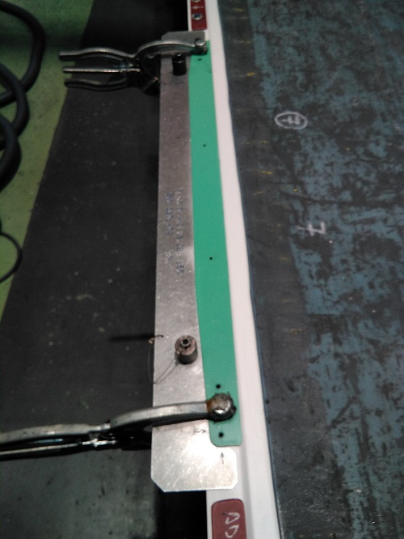

 

## op 80
+ Taladrar y Avellanar Karmans.
+ Secuencia de taladrado 2,5 - 3,25 - 4,15.

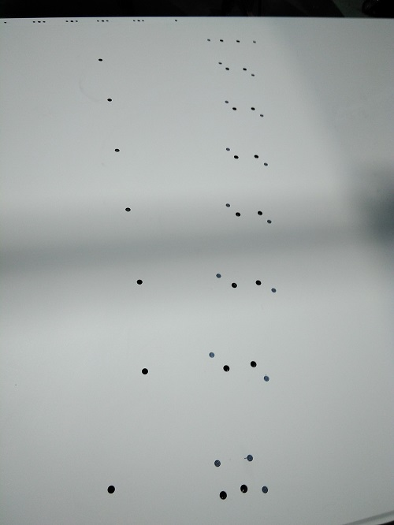
## op 90
+ Taladrar y Avellanar Antipeeling.
+ Secuencia de taladrado 2,5 - 3,25 - 4,15.

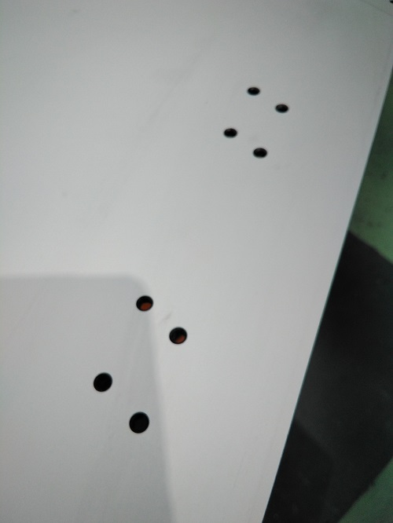
## op 101 
+ Remachar Bocaitos.

## op 102 
+ Verificar Bocaitos.
## op 110 
+ Taladrar desagues en revestimiento inferior.
+ Utilizar plantilla.
+ Secuencia de taladrado 2,5 - 4,8 - 6,33.
+ Rebarbar.

## op 120
+ Taladrar y Remachar Spacematic.

## op 125
+ Verificar Remachado Spacematic.
## op 130
+ Sellar.  

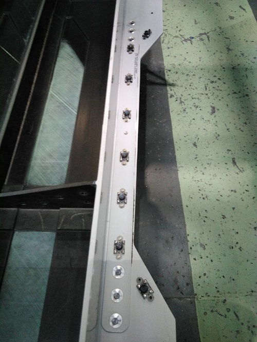

## op 140
+ Avellanar y Remachar bandas .

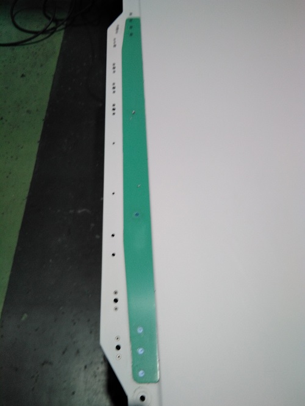

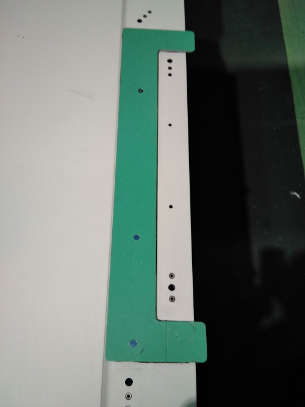

## op 150
+ Remachar Herrajes metalicos.

+ Remachar Herrajes metalicos.

+ Remachar Angular Costilla 3.

## op 151
+ Realizar: IV. Medicion de Continuidad.

## op 160
+ Remachar Porteria.

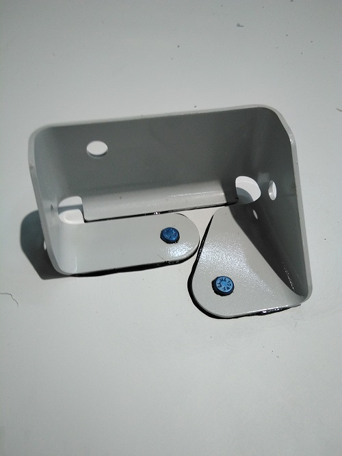

+ Remachar Karmans.

## op 170
+ Remachar Costillas.

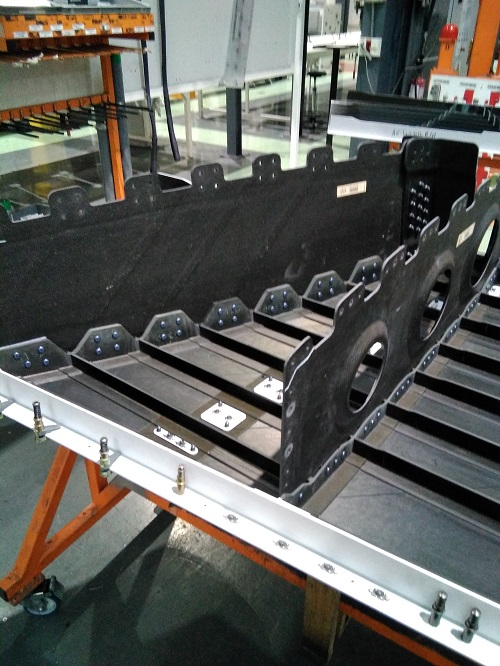
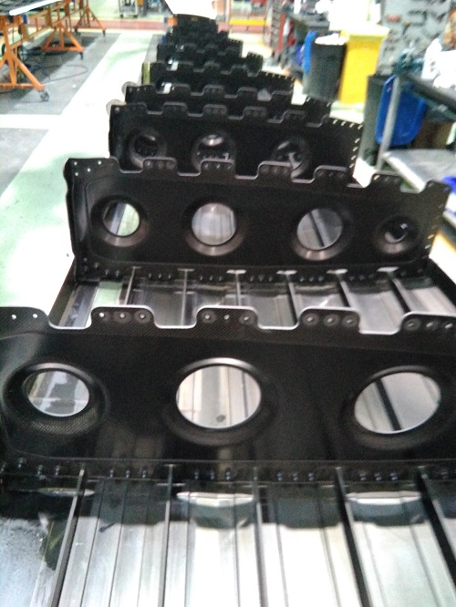
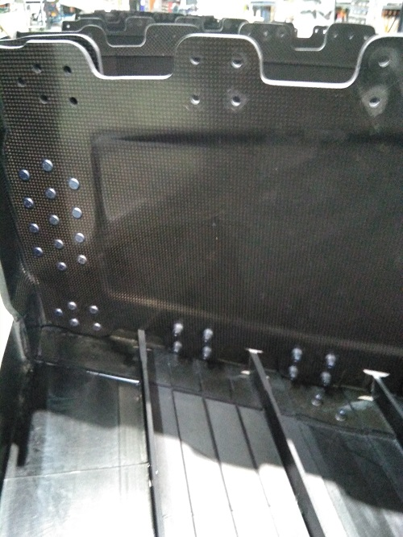

## op 171
+ Realizar: IV. Medicion de Estaje.

## op 180
+ Realizar:   FOD.

## op 190
+ Realizar:  Check-List
## op 200
+ Verificar:  Check-List
 