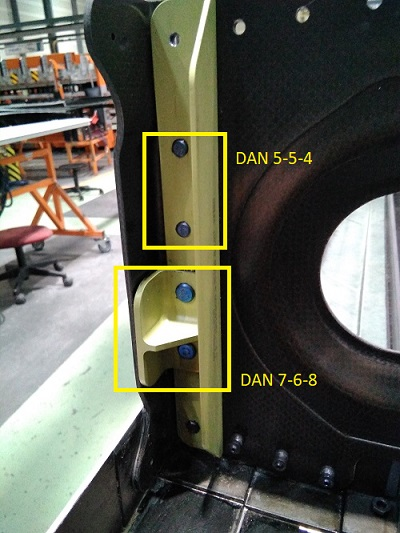

 
# Fase1-FG
 

## Secuencia de operaciones.

## op 10
+ Taladrar porteria en revestimiento superior.
+ Utilizar plantilla.
+ Secuencia de taladrado 2,5 - 4,15.
+ Rebarbar.

## op 20
+ Taladrar drenajes en revestimiento inferior.
+ Secuencia de taladrado 2,5 - 4,8 - 6,33.
+ Rebarbar.

## op 30
+ Taladrar costillas de 4 a 13 en revestimiento superior e inferior.
+ Secuencia de taladrado costillas 9 a 13: 2,5 - 3,25 - 4,17
+ Secuencia de taladrado costillas 4 a 8: 2,5 - 3,25 - 4,84
+ Rebarbar.

## op 40

+ Taladrar costillas de 2 y 3 en revestimiento superior e inferior.
+ Secuencia de taladrado: 2,5 - 3,25 - 4,84 - 6,33
+ Rebarbar.

## op 50
+ Rebarbar Taladros de Intercambialidad.
+ En Revestimiento superior e inferior.
+ Caras exterior e interior.

## op 60
+ Situar y taladrar a previo bandas portatuercas, karmans y soportes electicos.
1. Situar y taladrar a previo bandas portatuercas 

2. Situar y taladrar a previo karmans.

3. Situar y taladrar a previo  soportes electicos.

## op 70
+ Situar y taladrar bandas rigidas y preparar para sellar.
+ Utilizar plantilla. 
 

* Realizar zonas de masas en bandas porta-tuercas (26).
* Remachar tuercas flotates (3). 

|Remaches      |---------|Ubicacion rack|
|:------------:|---------|:------------:|
|?|         |?           |
|Tuercas       |---------|Ubicacion rack| 
|MS21060L3     |         |B19           |

## op 80
+ Taladrar y Avellanar Karmans.
+ Secuencia de taladrado 2,5 - 3,25 - 4,15.

## op 90
+ Taladrar y Avellanar Antipeeling.
+ Secuencia de taladrado 2,5 - 3,25 - 4,15.

* Aplicar caramelo.
## op 101 
+ Remachar Bocaitos.

|Remaches      |---------|Ubicacion rack|
|:------------:|---------|:------------:|
|ABS0112-24-03T|         |A1            |
|Tuercas       |---------|Ubicacion rack| 
|MS21072L04    |         |B25           |
 

## op 102 
+ Verificar Bocaitos.
## op 110 
+ Taladrar desagues en revestimiento inferior.
+ Utilizar plantilla.
+ Secuencia de taladrado 2,5 - 4,8 - 6,33.
+ Rebarbar.

## op 120
Taladrar y Remachar Spacematic.

 
|Remaches      |---------|Ubicacion rack|
|:------------:|---------|:------------:|
|ABS0112-24-03T|         |A1            |
|ABS0112-24-04T|         |A5            |
|Tuercas       |---------|Ubicacion rack| 
|MS21060L3     |         |B19           |
|MS21062L3     |         |B22           |

## op 125
+ Verificar Remachado Spacematic.
## op 130
+ Sellar bandas portatuercas, bandas rigidas, soportes electricos y porteria.  

 

## op 140
* Avellanar y Remachar bandas .

|Remaches   |---------|Ubicacion rack|
|:----------|---------|:------------:|
|ABS0214-3-5|         |A15           |
|ABS0214-3-6|         |A12           |
|ABS0214-3-7|         |A13           |
|ABS0214-3-8|         |A14           |
|ABS0214-4-5|         |A11           |
|ABS0214-4-6|         |A16           |
|ABS0214-4-7|         |A17           |

 

 

## op 150
+ Remachar Herraje metalico a costilla 4.

|Remaches  |---------|Ubicacion rack|
|:-------- |---------|:------------:|
|DAN 7-6-8 |         |B13           |
|Tuercas   |---------|Ubicacion rack| 
|ABS0258-6A|         |A3            |

* Remachar Herraje metalico a costilla 9.

|Remaches  |---------|Ubicacion rack|
|:-------- |---------|:------------:|
|DAN 5-5-4 |         |A24           |
|DAN 7-6-8 |         |B13           |
|Tuercas   |---------|Ubicacion rack|
|ABS0258-5A|         |A6            |
|ABS0258-6A|         |A3            |

* Remachar Angular a Costilla 3.

|Remaches  |---------|Ubicacion rack|
|:-------- |---------|:------------:|
|DAN 5-8-9 |         |A25           |
|Tuercas   |---------|Ubicacion rack| 
|ABS0258-8A|         |A18           |

## op 151
+ Realizar: IV. Medicion de Continuidad.

## op 160
+ Remachar Porteria.

|Remaches  |---------|Ubicacion rack|
|:-------- |---------|:------------:|
|DAN 5-5-6 |         |A23           |
|DAN 5-5-7 |         |A28           |
|Tuercas   |---------|Ubicacion rack| 
|ABS0258-5A|         |A6            |

 

+ Remachar Karmans.

|Remaches  |---------|Ubicacion rack|
|:-------- |---------|:------------:|
|DAN 6-5-4 |         |B1            |
|DAN 6-5-5 |         |B2            |
|DAN 6-5-8 |         |B4            |
|DAN 6-5-9 |         |B5            |
|DAN 6-5-10|         |B6            |
|DAN 6-5-11|         |B7            |
|Tuercas   |---------|Ubicacion rack| 
|ABS0258-5A|         |A6            |

## op 170
+ Remachar Costillas de la 3 a la 13.

|Remaches  |---------|Ubicacion rack|
|:-------- |---------|:------------:|
|DAN 7-5A3 |         |B8            |
|DAN 5-5-3 |         |A22           |
|DAN 5-5-4 |         |A24           |
|DAN 5-5-6 |         |A23           |
|DAN 7-6-4 |         |B9            |
|DAN 7-6-5 |         |B11           |
|DAN 5-8-8 |         |A26           |
|DAN 5-8-12|         |A20           |
|DAN 5-8-13|         |A30           |
|Tuercas   |---------|Ubicacion rack| 
|ABS0258-5A|         |A6            |
|ABS0258-6A|         |A3            |
|ABS0258-8A|         |A18           |

 
+ Remachar Costillas de la 5 a la 13.

+ Remachar Costilla  4.

+ Remachar Costilla  3.

## op 171
+ Realizar: IV. Medicion de Estaje.

## op 180
+ Realizar:   FOD.

## op 190
+ Realizar:  Check-List
## op 200
+ Verificar:  Check-List
 