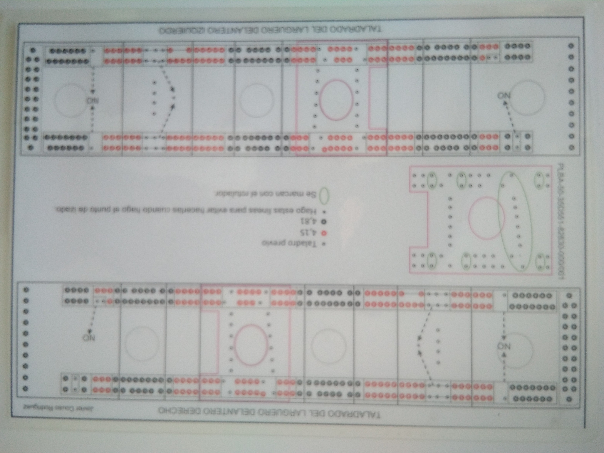
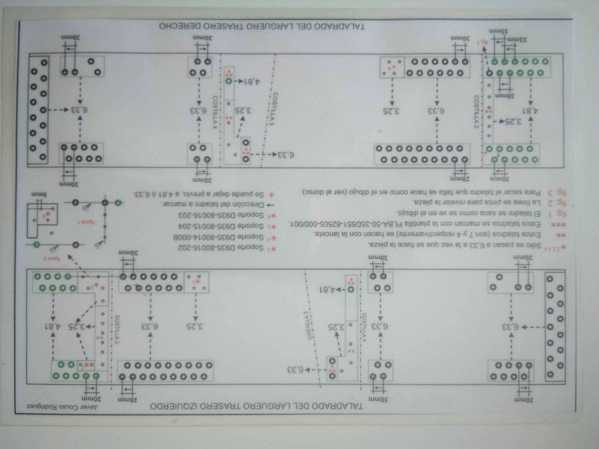
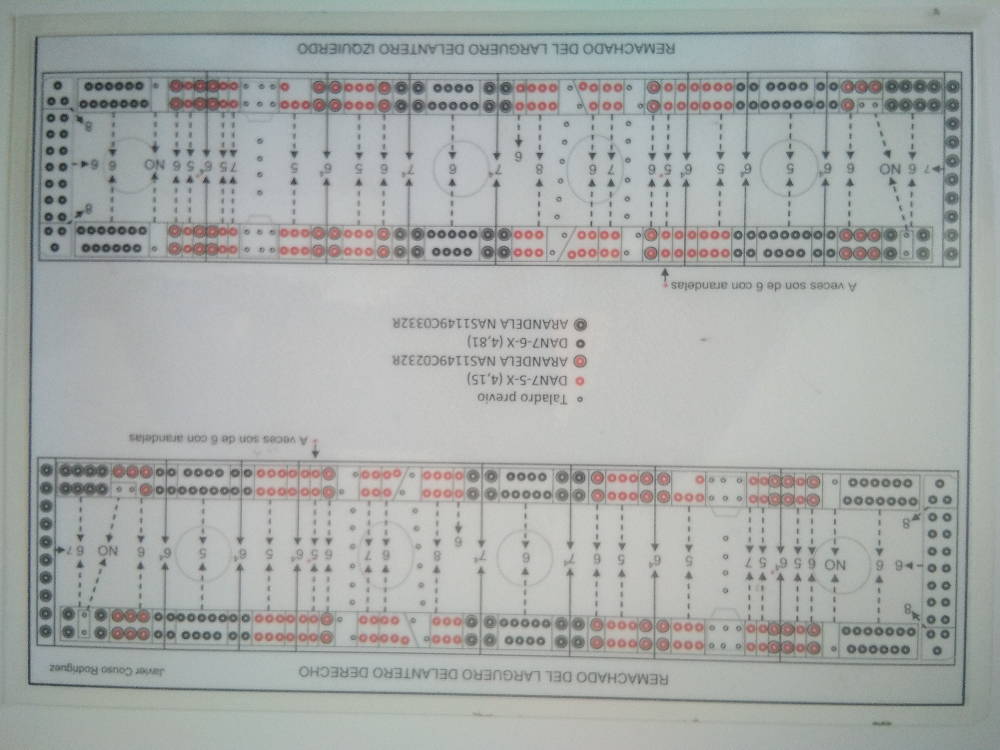
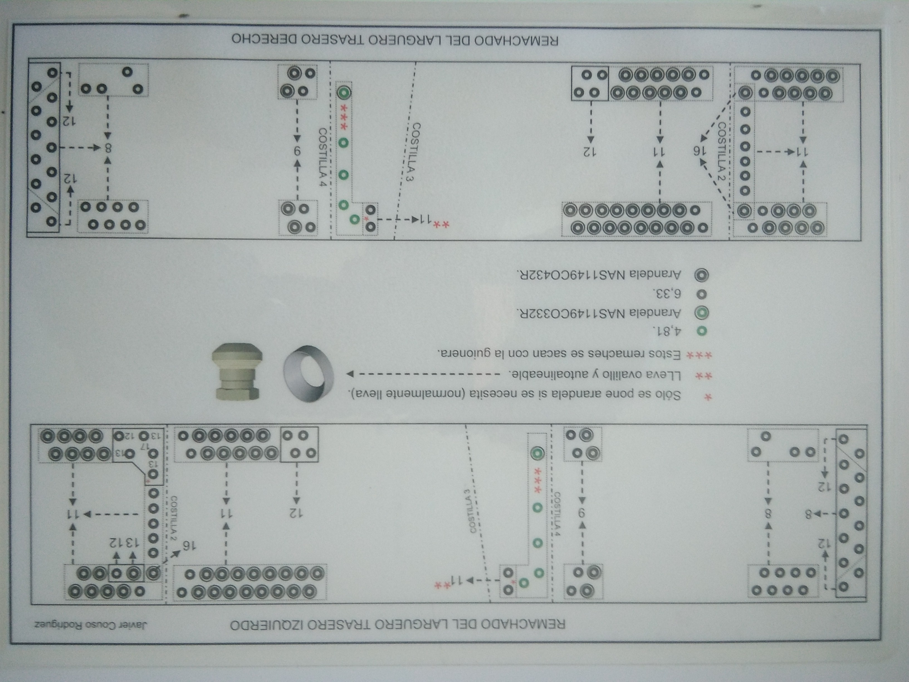
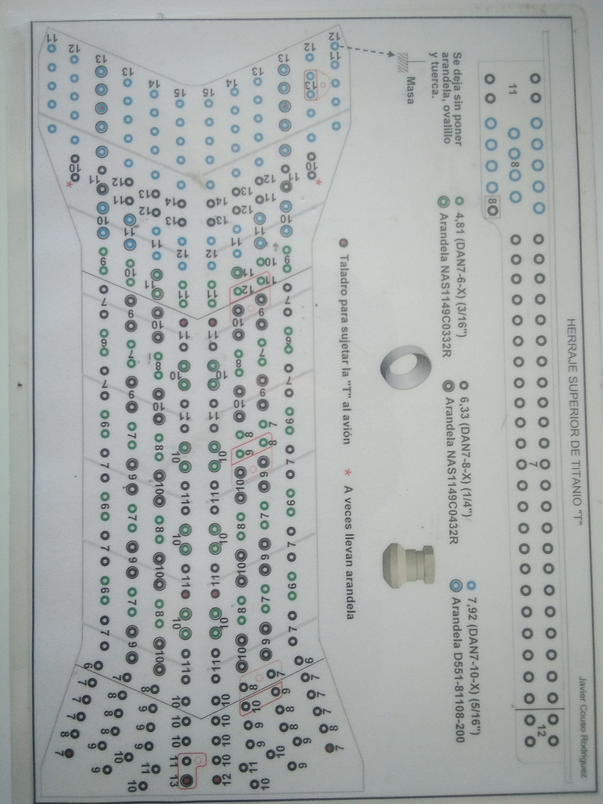
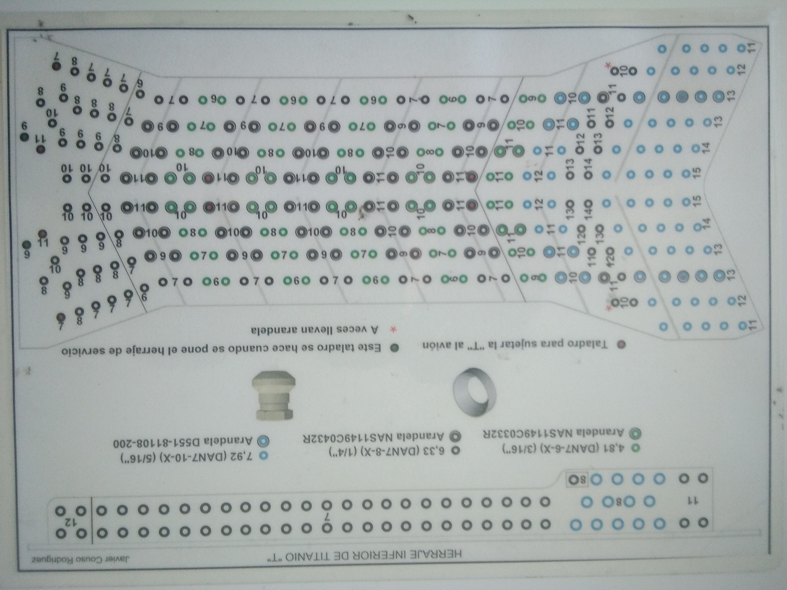

# Union
***
## Operaciones de Union
 
### * Taladrar Largero delantero.

 
***
### * Taladrar Largero trasero.

  
***
### * Remachar Largero delantero.

 
***
### * Remachar Largero trasero.

   
***
### * Remachar Herraje de Titanio superior.

 
***
 ### * Remachar Herraje de Titanio inferior.

 

 ***