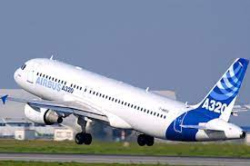
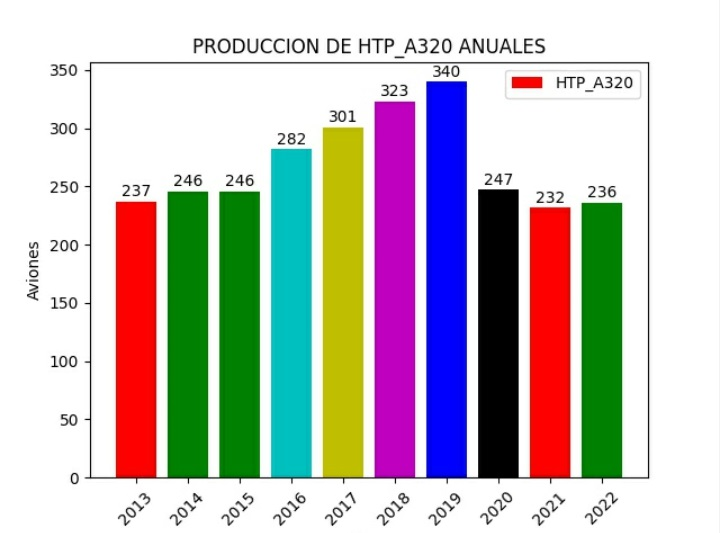
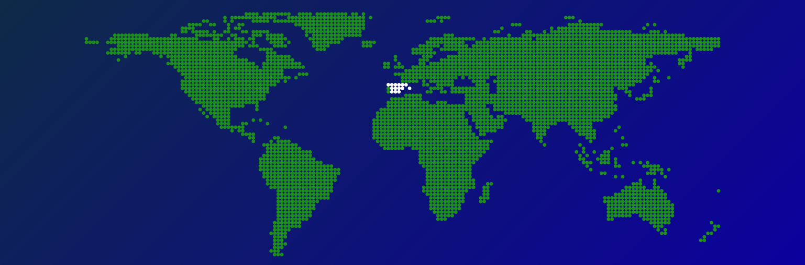

# intro

---

> _Esto es una guia-tutorial de las operaciones realizadas en cada fase del programa **HTP-A320**._



:::info HTP-A320
<button onClick={() => alert('Operaciones realizadas en cada fase del programa **HTP-A320**')}>Click me!</button>
:::

---

### _Aqui puedes ver una grafica de las producciones anuales._



---

###  _Aqui tienes el codigo en Python para crear la grafica de barras._

:::info htp_a320.py

```python
import matplotlib.pyplot as plt
import numpy as np

# Datos para la gráfica de barras
años =  np.arange(2013,2023)
aviones = [237, 246, 246, 282, 301, 323, 340, 247, 232, 236]

# Crear la gráfica de barras
plt.figure(figsize=(8, 6))  # Tamaño de la figura

grafica = plt.bar(años, aviones, label="HTP_A320",  color=['r','g','b','c','y','k'])  # Crear la gráfica de barras

plt.xlabel('años')  # Etiqueta del eje X
plt.ylabel('aviones')  # Etiqueta del eje Y
plt.title('PRODUCCION DE HTP_A320 ANUALES')  # Título de la gráfica
plt.bar_label(grafica, padding=1)
plt.xticks(años)
plt.xticks(rotation=45)
plt.legend()
plt.savefig("HTP_A320.jpg") # guarda la grafica en una imagen en  formato .jpg
plt.show()  # Mostrar la gráfica

```

:::

---

> _Aqui tienes un enlace para ver un video creado con inteligencia artificial._

## [AIRBUS A320](../../static/videos/htp-a320.mp4)

---

> _Aqui tienes un enlace para ver una presentacion creada con inteligencia artificial._

## [AIRBUS_HTP_A320](https://tome.app/juan-b71/la-linea-de-produccion-del-htpa320-de-airbus-en-cadiz-una-maravilla-de-la-ingenieria-aeronautica-cljkrm5qm0jnvo73blf3oj2n7)

---



---
