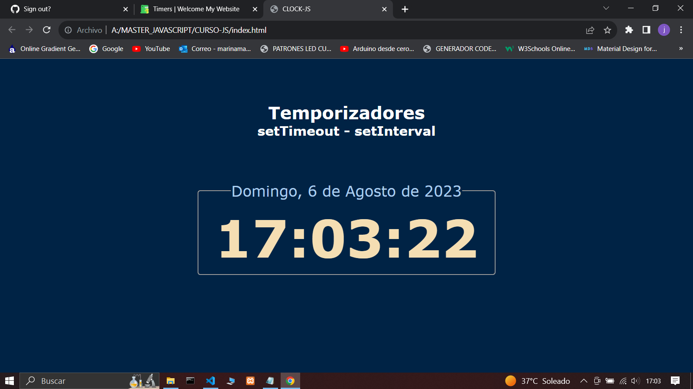

## Codigos en Javascript


---

### * setTimeout

:::tip

> setTimeout - ejecuta una funcion DESPUES de cierto tiempo.

```javascript
function saludo(nombre) {
  console.log(`Hola ${nombre}, buenos dias.`);
}

let temporizador = setTimeout(saludo, 1000, "Juan Marin");

clearTimeout(temporizador);
```

:::

:::tip

> setTimeout Anidado

```javascript
let num = 0;
let incrementoID = setTimeout(function incremento() {
  console.log(num);
  num++;

  incrementoID = setTimeout(incremento, 1000);

  if (num === 10) {
    clearTimeout(incrementoID);
  }
}, 1000);
```

:::

---

### * setInterval

:::tip

> setInterval - ejecuta una funcion CADA de cierto tiempo.

```javascript
let numero = 5;

function conteo() {
  console.log(`Lanzamiento en ${numero} segundos`);
  numero--;
  if (numero === -1) {
    clearInterval(lanzamiento);
  }
}

let lanzamiento = setInterval(conteo, 1000);
```

:::
:::tip

> Con funciones flecha

```javascript
let numero1 = 5;

let lanzamiento1 = setInterval(() => {
  console.log(`Lanzamiento1 en ${numero1} segundos`);
  numero1--;
  if (numero1 === -1) {
    clearInterval(lanzamiento1);
  }
}, 1000);
```

:::

---
# PAGINA WEB (Archivos)
## Ejemplo de un Reloj



---

:::tip Archivo
> index.html
:::

```html
<!DOCTYPE html>
<html lang="es">

<head>
    <meta charset="UTF-8">
    <meta name="viewport" content="width=device-width, initial-scale=1.0">
    <title>CLOCK-JS</title>

    <link rel="stylesheet" href="styles.css">
</head>

<body>
    <h1>Temporizadores</h1>
    <h2>setTimeout - setInterval</h2>

    <fieldset>
        <legend id="fecha"> </legend>
        <h2 id="reloj"> </h2>
    </fieldset>


    <script src="clock.js"></script>

</body>

</html>
```
---

:::tip Archivo
> clock.js
:::

```javascript

let mostrarFecha = document.getElementById("fecha");
let mostrarReloj = document.getElementById("reloj");

let fecha = new Date();

let diaSemana = [
  "Domingo",
  "Lunes",
  "Martes",
  "Miercoles",
  "Jueves",
  "Viernes",
  "Sabado",
];
let mesAnyo = [
  "Enero",
  "Febrero",
  "Marzo",
  "Abril",
  "Mayo",
  "Junio",
  "Julio",
  "Agosto",
  "Septiembre",
  "Agosto",
  "Octubre",
  "Noviembre",
  "Diciembre",
];

mostrarFecha.innerHTML = `${
  diaSemana[fecha.getDay()]
}, ${fecha.getDate()} de  ${
  mesAnyo[fecha.getMonth()]
} de ${fecha.getFullYear()}`;

setInterval(() => {
  let hora = new Date();
  mostrarReloj.innerHTML = hora.toLocaleTimeString();
});
```
---
:::tip Archivo
> styles.css
:::

```css

*{
    margin: 0  ;
    padding: 0;
    box-sizing: border-box;
}
body{
font-family: Verdana, Geneva, Tahoma, sans-serif;
    background-color: #002345;
    color: #abcdef;
}

h1{
    text-align: center;
    margin: 80px 20px 0;
    color:white;
}
#subtitulo{
    text-align: center;
    margin-bottom: 80px;
    color: white;
}

legend{

    font-size: 1.7em;
    padding: 0.7px;
}
fieldset{
    width: 350px;
    margin: 0 auto;
    text-align: center;
    border-radius: 5px;
    padding: 10px 30px;
}
#reloj{
    font-size: 6em;
    color: wheat;
}
```
---