---

## Entradas de Los PLC  S7-1200.

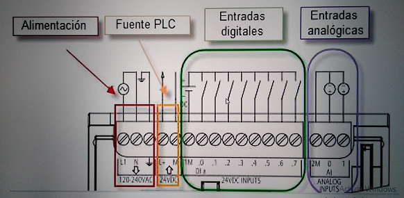

## Esquema basico de conexion.

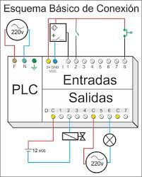

* Conexion de un sensores PNP y NPN. 

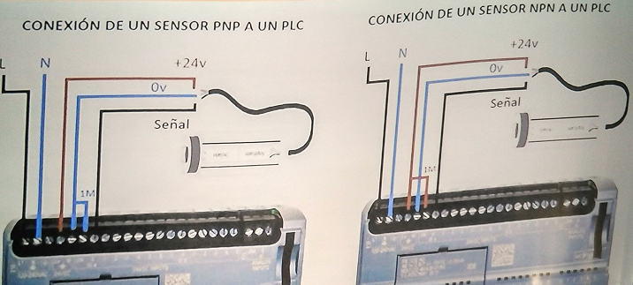


* Conexion de un sensor de presion.

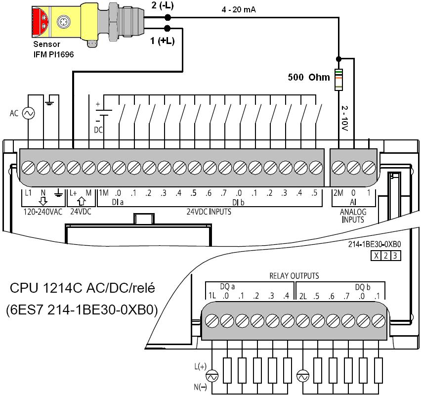


* Conexion de un Encoder. 

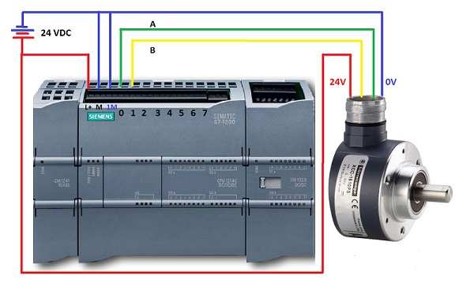

---

## Eliminar contraseña del S7-1200

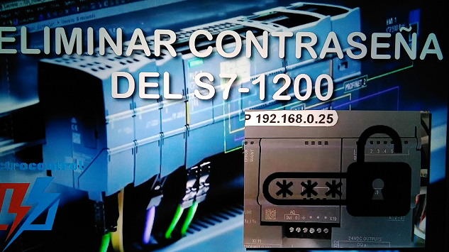

> Instalacion de un plc que no conocemos la contrseña.

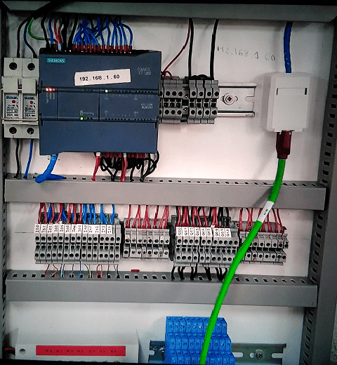

```

1. Con una  MEMORY CARD  de siemens.

2. La introducimos en el lector de tarjetas del PC 

3. Creamos una carpeta y copiamos los archivos de la memory card (backup).

4. Borramos los archivos memory card.

```

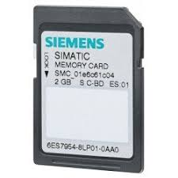

---

```

1. Abrimos TIA-PORTAL

2. Cargamos un programa que no tenga contraseña en la  MEMORY CARD. 

3. Apagamos el PLC y insertamos la  MEMORY CARD. 

```

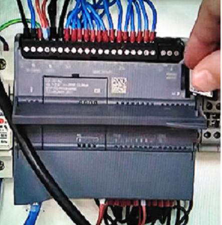

```

4. Encendemos el PLC y esperamos unos minutos.

5. Apagamos el PLC y retiramos la  MEMORY CARD. 

```

---

```

1. Abrimos TIA-PORTAL

2. Probamos a cargar algun programa en el PLC.

```

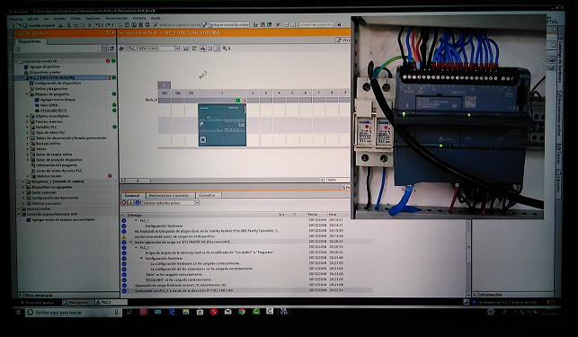


---

## Resumen.

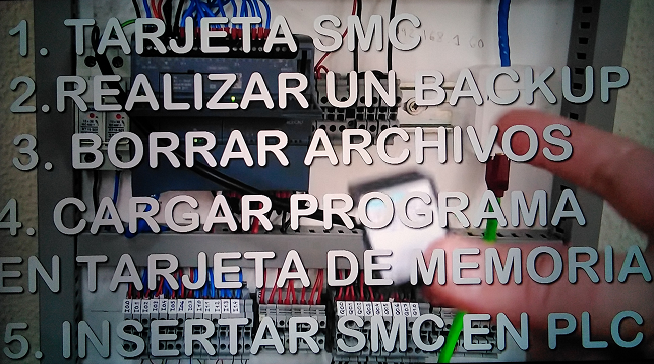


 ---


