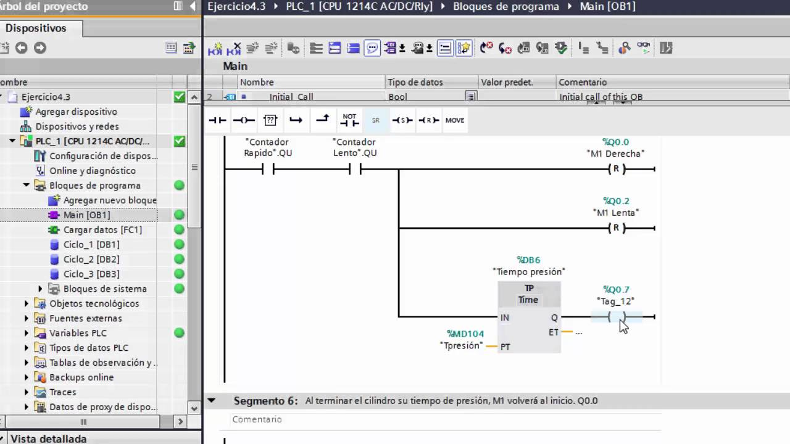
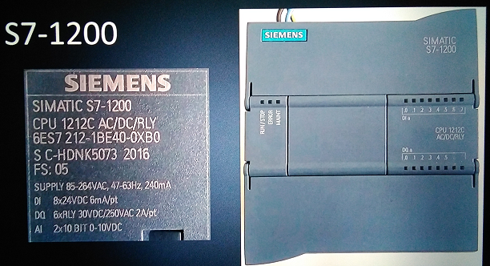
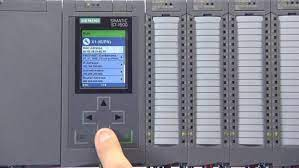

 
---

## ¿Qué es TIA Portal de Siemens?

>TIA Portal significa Totally Integrated Automation Portal o en cristiano portal de automatización totalmente integrado.

> TIA Portal es un software para la programación de PLC de Siemens.

---

## Los PLC nacidos con TIA Portal

  * S7-1200: solo se puede programar con TIA Portal y con la licencia básica podrás programarlo.

* S7-1500: la familia más potente del catálogo de Siemens. Solo se pueden programar con TIA Portal y es necesario la licencia profesional para poder automatizar con ello.

---

 

 

