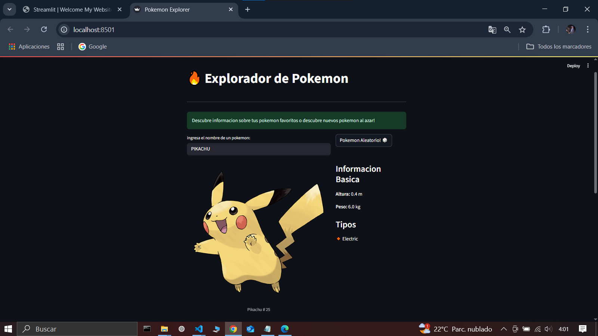

:::info
## A faster way to build webs and share data apps with Python
:::


---

### VISITAR PAGINA
 ## [Streamlit](https://streamlit.io/)
 

---
### CREAR UNA CARPETA DEL PROYECTO.

### ABRIR POWERSHELL 
### CREAR UN ENTORNO VIRTUAL. 
```
PS E:\E_2025\Framework STREAMLIT> python -m venv .venv
```

### ACTIVAR EL ENTORNO VIRTUAL.  
```
PS E:\E_2025\Framework STREAMLIT> .venv/Scripts/activate
```

### INSTALAR LIBRERIAS NECESARIAS.  
```
(.venv) E:\E_2025\Framework STREAMLIT> pip install streamlit pandas plotly 
```

### DESACTIVAR EL ENTORNO VIRTUAL.  
:::danger
```
(.venv) E:\E_2025\Framework STREAMLIT> deactivate
```
:::

### ABRIR VISUAL STUDIO CODE
```
PS E:\E_2025\Framework STREAMLIt>code .  
```

### CREAR UN ARCHIVO app.py
 
```python
import streamlit as st
import random
import requests


st.set_page_config(
    page_title="Pokemon Explorer",
    page_icon=" 🔥 ",
    layout="centered"
)

# Funcion para obtener datos de un pokemon
def get_pokemon_data(pokemon_name):
    try:
        response = requests.get(f"https://pokeapi.co/api/v2/pokemon/{pokemon_name.lower()}")
        if response.status_code==200:
            return response.json()
        else:
            return None
    except:
        return None
    
# Funcion para obtener datos de un pokemon aleatorio

def get_random_pokemon():
    random_id= random.randint(1, 1010)
    return get_pokemon_data(str(random_id))


# data = get_pokemon_data("pikachu")
# print(data)

# Titulo y descripcion

st.title(" 🔥 Explorador de Pokemon")
st.divider()
st.success("Descubre informacion sobre tus pokemon favoritos o descubre nuevos pokemon al azar!")

# Crear dos columnas para la busqueda y boton aleatorio

col1, col2 = st.columns([2,1])

with col1:
    pokemon_name = st.text_input("ingresa el nombre de un pokemon:","")

with col2:
    random_button = st.button("Pokemon Aleatorio! 🎲")

pokemon_data = None


# Manejar la busqueda y boton aleatorio

if pokemon_name:
    pokemon_data = get_pokemon_data(pokemon_name)
elif random_button:
    pokemon_data = get_random_pokemon()

 
# Mostrar informacion del pokemon  
if pokemon_data:
   # Crear dos columnas para la imagen y la informacion
    img_col, info_col = st.columns([2,1])

    with img_col:
        # Mostrar imagen  del pokemon  
        st.image(
            pokemon_data["sprites"]["other"]["official-artwork"]["front_default"],
            caption=f" {pokemon_data["name"].title()}  # {pokemon_data["id"]} ",
            use_container_width=True
        )

    with info_col:
       # Informacion Basica
       st.subheader ("Informacion Basica")
       st.write(f"**Altura:** {pokemon_data["height"]/10 } m")
       st.write(f"**Peso:** {pokemon_data["weight"]/10 } kg")
       # Tipos
       st.subheader("Tipos")
       tipos = [tipo["type"]["name"] for tipo in pokemon_data["types"]]
       for tipo in tipos:
           st.write(f" 🔸 {tipo.title()}")

    st.divider()
    # Estadisticas
    st.info(" ### Estadisticas")
    stats_cols = st.columns(3)
    stats = pokemon_data["stats"]

    for idx, stat in enumerate (stats):
        col_idx = idx % 3
        with stats_cols [col_idx]:
            st.metric(
                label=stat["stat"]["name"].replace("-", " ").title(),
                value=stat["base_stat"]
            )

    st.divider() 
    # Habilidades
    st.info(" ### Habilidades")
    abilities= [ability["ability"]["name"].replace("-", " ").title()
                for ability in pokemon_data["abilities"]]

    for ability in abilities:
        st.write (f" ⭐ {ability}")

elif pokemon_name:
    st.error("Pokemon no encontrado! Verifica el nombre e intenta nuevamente")
else:
    st.info(" 👆 Ingresa el nombre de un pokemon o prueba con uno aleatorio")

st.divider()
 
st.warning("#### Juamaya 🍺 2025")


```  
 

---


### ACTIVAR EL SERVIDOR Y EJECUTAR LA APLICACION.
```
(.venv) PS E:\E_2025\Framework STREAMLIT> streamlit run app.py
```

  


### VER LA APLICACION EN EL NAVEGADOR.
:::tip  
 You can now view your Streamlit app in your browser.
 

>En el navegador escribimos :

 http://localhost:8501  

>Pulsar crtl y hacer click en 

 Local URL: http://localhost:8501 👈

 Network URL: http://192.168.0.17:8501 👈

:::
---



:::danger  PARAR EL SERVIDOR:
 > Pulsar  Crtl + C
:::
