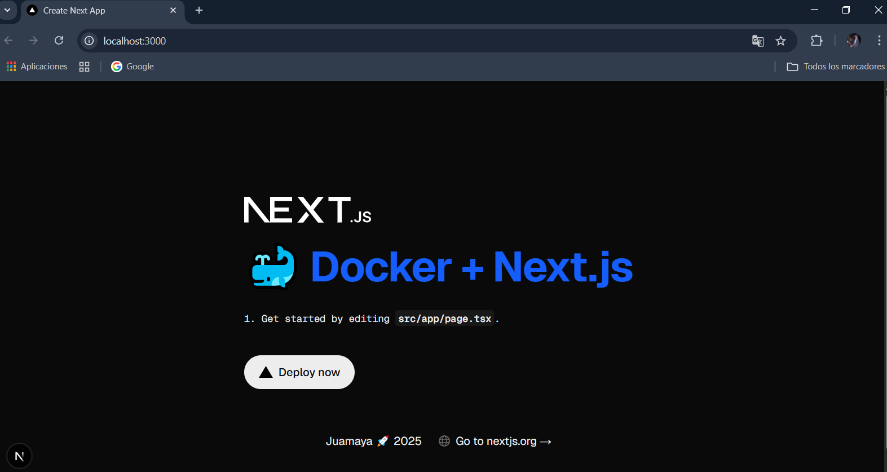

# Docker + Next

## Crear Proyecto

```bash
npx create-next-app@latest
```
## Getting Started

First, run the development server:

```bash
npm run dev
# or
yarn dev
# or
pnpm dev
# or
bun dev
```
# 🐳
# <font color="#00ff00" > Crear un Contenedor para el Proyecto</font>




## Crear archivo: Dockerfile en la raiz de tu proyecto

:::info

>Dockerfile


```js
FROM node:alpine

WORKDIR /app

COPY package.json ./
COPY package-lock.json ./

RUN npm install --omit=dev

COPY . ./

RUN npm run build

EXPOSE 3000

CMD ["npm", "start"]

```
:::

## Crear archivo: package.json

>package.json

```json
{
  "name": "docker-next",
  "version": "0.1.0",
  "private": true,
  "scripts": {
    "dev": "next dev --turbopack",
    "build": "next build",
    "start": "next start",
    "lint": "next lint"
  },
  "dependencies": {
    "react": "19.1.0",
    "react-dom": "19.1.0",
    "next": "15.4.5"
  },
  "devDependencies": {
    "typescript": "^5",
    "@types/node": "^20",
    "@types/react": "^19",
    "@types/react-dom": "^19",
    "@tailwindcss/postcss": "^4",
    "tailwindcss": "^4",
    "eslint": "^9",
    "eslint-config-next": "15.4.5",
    "@eslint/eslintrc": "^3"
  }
}

```

## Crear archivo: .dockerignore

>.dockerignore

```bash
node_modules

```
## <font color="#6bbfe5ff">Abre Terminal en VScode.</font>

### <font color="#00ff00">Ejecuta estos comandos dentro de la carpeta del proyecto</font>

:::info

## Crear imagen
>docker-next

```bash
wsl docker build -t docker-next .
```

## Crear y correr contenedor
>next-container
```bash
wsl docker run -d --name next-container -p 4000:3000 docker-next
```

## Ver imagenes
```bash
wsl docker images
```


## Ver contenedor
```bash
wsl docker ps -a
```


## Start contenedor
```bash
wsl docker start next-container
```


## Stop contenedor
```bash
wsl docker stop next-container
```

## Eliminar contenedor
```bash
wsl docker rm next-container
```

## Stop contenedor  y  Eliminar contenedor
```bash
wsl docker stop next-container &&  wsl docker rm next-container
```

## Eliminar imagen
```bash
wsl docker rmi docker-next
```

## Para crear y levantar el contenedor:

<font color="#00ff00" >En la terminal, desde la carpeta del proyecto, ejecuta:</font>

```bash
wsl docker run -d --name next-container -p 4000:3000 docker-next
```

:::

###  Luego abre tu navegador y visita: http://localhost:4000

---

# 🐧 Instalar Docker en Windows sin Docker Desktop, usando WSL2 y Ubuntu

## ✅ Requisitos previos 

:::warning

Windows 10/11 actualizado

Habilitar WSL y la Máquina Virtual

WSL2 activado

Ubuntu instalado desde Microsoft Store

:::

¿Ya tienes WSL2 y Ubuntu instalado? Si no, te lo explico abajo.  

## PASO 1 🔧: Instalar WSL2 y Ubuntu

:::info

1.1 Instala WSL con Ubuntu desde CMD o PowerShell:

```bash
wsl --install -d Ubuntu
```
:::

<font color="#000ff00">Esto instala Ubuntu y configura WSL2 automáticamente. Luego reinicia tu PC si se te solicita.</font>

## PASO 2: 🐳 Instalar Docker en Ubuntu (WSL2)

# <font color="#ff0000">Abre Ubuntu desde el menú Inicio.</font>

:::info

## <font color="#ff0000">Ejecuta estos comandos dentro de Ubuntu:</font>

```bash
# Actualizar el sistema
sudo apt update && sudo apt upgrade -y


# Instalar Docker

sudo apt install docker.io -y


# Habilitar el servicio de Docker
sudo service docker start

# Añadir tu usuario al grupo docker (para evitar usar sudo cada vez)

sudo usermod -aG docker $USER
```
:::

Sal del terminal con<font color="#ff0000"> **exit**, cierra Ubuntu y vuelve a abrirlo </font>para aplicar los cambios de grupo.

## ✅ Verifica que Docker funciona

:::tip

## <font color="#ff0000">Ejecuta estos comandos dentro de Ubuntu:</font>


```bash
docker --version
docker run hello-world
```

Si ves un mensaje de bienvenida, Docker está funcionando sin Docker Desktop
 # 🎉

:::

---

## 🧠 Opcional: Ejecutar Docker automáticamente al abrir Ubuntu

Cada vez que abras Ubuntu, ejecuta:

```bash
sudo service docker start
```

Para automatizarlo:

```bash
echo "sudo service docker start" >> ~/.bashrc
```

Para ver si esta corriendo docker:

```bash
sudo service docker status
```

---

## 🎁 Beneficios

:::tip

Mucho menos uso de CPU y RAM.

Cero uso de Docker Desktop.

Mejor integración con Linux-based dev tools.

:::  
